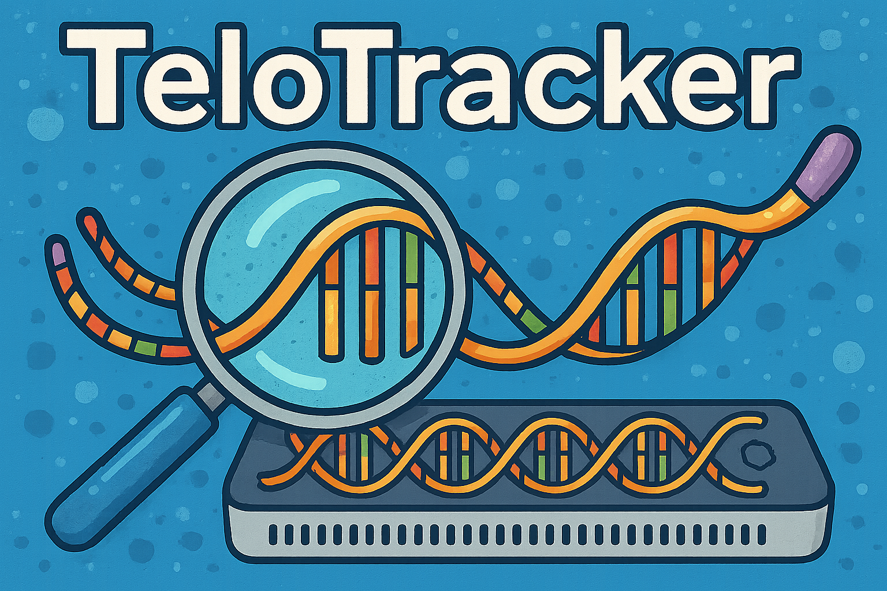

# TeloTracker
<p align="center"></p>
Yeast Telomere Identification in Nanopore Reads

`TeloTracker` is a Python package designed to track and visualize Oxford Nanopore Technology (ONT) Sequencing of yeast telomeres. `TeloTracker` was specifically developed to track and analyze the development of Alternative Lengthening of Telomeres in yeast, but the program can be appied/adapted to follow the dynamics of yeast telomeres in general.

## Installation
To install `TeloTracker`, you can clone this repository by running the command below.

```bash
git clone https://github.com/Jacob-M-Wells/TeloTracker.git
cd TeloTracker
```

### Installing with conda (recommended)
```bash
conda env create -n telotracker -f environment.yml
conda activate telotracker
```

### Installing with pip
```bash
pip install -r requirements.txt
```

### ⚠️ Note for pip Users

If you install `telotracker` via pip, please be aware that several required **external tools** are **not available on PyPI** and must be installed separately. These tools are automatically installed when using Conda, but pip users must ensure they are accessible in the system `PATH`.

To avoid missing dependencies, we **strongly recommend using Conda** (see above).

The following external tools are required:

- [`BLAST+`](https://blast.ncbi.nlm.nih.gov/Blast.cgi) (version 2.16.0)
- [`RepeatMasker`](http://www.repeatmasker.org/) (version 4.1.7-p1)
- [`Porechop_ABI`](https://github.com/bonsai-team/Porechop_ABI) (≥0.5.0)
- [`Clustal Omega`](http://www.clustal.org/omega/) (version 1.2.4)
- [`Flye`](https://github.com/fenderglass/Flye) (version 2.9.5)
- [`Minimap2`](https://github.com/lh3/minimap2) (version 2.28)
- [`QUAST`](http://quast.sourceforge.net/) (version 5.3.0)
- [`Medaka`](https://github.com/nanoporetech/medaka) (version 2.0.1)
- [`MUMmer`](https://mummer4.github.io/) (version 3.23)
- [`MUSCLE`](https://www.drive5.com/muscle/) (version 5.3)
- [`SAMtools` & `BCFtools](http://www.htslib.org/) (version 1.21)
- [`BEDtools`](https://bedtools.readthedocs.io/) (version 2.31.1)
- [`RMBlast`](http://www.repeatmasker.org/RMBlast.html) (version 2.14.1)

## Installing Dorado (Required for Basecalling)

[Dorado](https://github.com/nanoporetech/dorado) is a high-performance, open source basecaller for Oxford Nanopore reads. It must be installed separately, as it is not available through pip or conda. It is required to do the basecalling in
dorado (rather than in MinKnow) as we need to basecall with specific parameters - most notably without trimming adapter sequences.

📦 Download the latest release for your platform from the [Dorado GitHub Releases page](https://github.com/nanoporetech/dorado/releases).

📝 Detailed instructions and usage examples are available in the [Dorado documentation](https://dorado-docs.readthedocs.io/en/latest/).

### Current version as of 03/13/2025: Dorado 0.9.1 @ https://cdn.oxfordnanoportal.com/software/analysis/dorado-0.9.1-linux-x64.tar.gz
### Example command to install this version of Dorado
```bash
wget https://cdn.oxfordnanoportal.com/software/analysis/dorado-0.9.1-linux-x64.tar.gz
gunzip https://cdn.oxfordnanoportal.com/software/analysis/dorado-0.9.1-linux-x64.tar.gz
tar -xvf https://cdn.oxfordnanoportal.com/software/analysis/dorado-0.9.1-linux-x64.tar.gz
mv dorado-0.9.1-linux-x64/ ~/bin/
ln -s ~/bin/dorado-0.9.1-linux-x64/bin/dorado ~/bin/dorado
source ~/.bashrc
```


## Usage

`TeloTracker` processes ONT waveform data (.pod5/.fast5 files) to basecall and analyze reads for their telomere and sub-telomere features. `TeloTracker` has two distinct pipelines (`clonal` and `population`) to analyze the telomeres of the corresponding cells.


## Clonal Analysis Pipepline


## Populaiton Analysis Pipepline


################################################


## Environment telotracker: is the main environment

## Environment telotracker-clair3: contains clair3 (needs python 3.9) and some other basic sequence mapping packages in the defaul telotracker environment


# Once the telotracker environment is created, activate the environment and run the following commands:

## 1. To fully install quast:

quast-download-gridss
quast-download-silva

### Change the dataset web address for Busco
### Works as of 11/19/2024
```bash
OLD_BUSCO_BACTERIA_DB="https://busco-archive.ezlab.org/v3/datasets/bacteria_odb9.tar.gz"
OLD_BUSCO_FUNGI_DB="https://busco-archive.ezlab.org/v3/datasets/fungi_odb9.tar.gz"
OLD_BUSCO_EUKARYOTA_DB="https://busco-archive.ezlab.org/v3/datasets/eukaryota_odb9.tar.gz"

NEW_BUSCO_BACTERIA_DB="https://busco-data.ezlab.org/v5/data/lineages/bacteria_odb10.2024-01-08.tar.gz"
NEW_BUSCO_FUNGI_DB="https://busco-data.ezlab.org/v5/data/lineages/fungi_odb10.2024-01-08.tar.gz"
NEW_BUSCO_EUKARYOTA_DB="https://busco-data.ezlab.org/v5/data/lineages/eukaryota_odb10.2024-01-08.tar.gz"

BUSCO_INSTALL_PATH="$CONDA_PREFIX/lib/python3.*/site-packages/quast_libs/run_busco.py"

sed -i "s|$OLD_BUSCO_BACTERIA_DB|$NEW_BUSCO_BACTERIA_DB|g" $BUSCO_INSTALL_PATH
sed -i "s|$OLD_BUSCO_FUNGI_DB|$NEW_BUSCO_FUNGI_DB|g" $BUSCO_INSTALL_PATH
sed -i "s|$OLD_BUSCO_EUKARYOTA_DB|$NEW_BUSCO_EUKARYOTA_DB|g" $BUSCO_INSTALL_PATH

# sed -i 's|https://busco-archive.ezlab.org/v3/datasets/bacteria_odb9.tar.gz|https://busco-data.ezlab.org/v5/data/lineages/bacteria_odb10.2024-01-08.tar.gz|g' $BUSCO_INSTALL_PATH
# sed -i 's|https://busco-archive.ezlab.org/v3/datasets/fungi_odb9.tar.gz|https://busco-data.ezlab.org/v5/data/lineages/fungi_odb10.2024-01-08.tar.gz|g' $BUSCO_INSTALL_PATH
# sed -i 's|https://busco-archive.ezlab.org/v3/datasets/eukaryota_odb9.tar.gz|https://busco-data.ezlab.org/v5/data/lineages/eukaryota_odb10.2024-01-08.tar.gz|g' $BUSCO_INSTALL_PATH

quast-download-busco
```

### Quast install notification

"""
Executing transaction: - The default QUAST package does not include:
* GRIDSS (needed for structural variants detection)
* SILVA 16S rRNA database (needed for reference genome detection in metagenomic datasets)
* BUSCO tools and databases (needed for searching BUSCO genes) -- works in Linux only!

To be able to use those, please run
    quast-download-gridss
    quast-download-silva
    quast-download-busco
                          
"""
