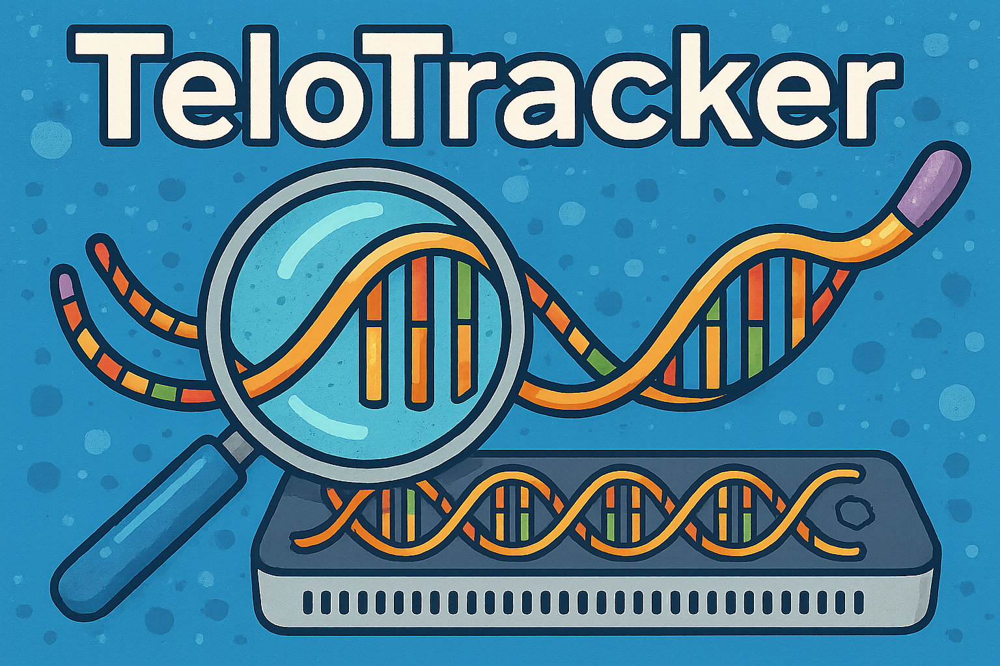

<p align="center"></p>


# TeloTracker
A pipeline for long-read sequencing data of yeast telomeres.

`TeloTracker` is a Python package designed to track and visualize long read sequencing data (Oxford Nanopore Technology (ONT) and PacBio) sequencing of yeast telomeres. `TeloTracker` was specifically developed to track and analyze the development of Alternative Lengthening of Telomeres in yeast, but the program can be appied/adapted to follow the dynamics of yeast telomeres in general.

## Installation
To install `TeloTracker`, you can clone this repository by running the command below.

```bash
git clone https://github.com/Jacob-M-Wells/TeloTracker.git
cd TeloTracker
```

### Installing with conda (Recommended)
```bash
conda env create -n telotracker -f environment.yml
conda activate telotracker
```

## Installing Dorado (Required if doing basecalling)

[Dorado](https://github.com/nanoporetech/dorado) is a high-performance, open source basecaller for Oxford Nanopore reads. Dorado can be run with a docker container or installed locally.

Dorado must be used to basecall (rather than using MinKnow), as basecalling without trimming adapters/barcode sequences is required.

📝 Detailed instructions and usage examples are available in the [Dorado documentation](https://dorado-docs.readthedocs.io/en/latest/).

#### Option 1. Run with Docker Container (using singularity)
📦 Download the latest release for your platform from the [Dorado Docker Releases page](https://hub.docker.com/r/nanoporetech/dorado/tags).
```bash
singularity pull dorado.sif docker://nanoporetech/dorado:latest
singularity exec dorado.sif dorado --help
```

#### Option 2. Run with local installation
📦 Download the latest release for your platform from the [Dorado GitHub Releases page](https://github.com/nanoporetech/dorado/releases).
The current version as of 03/13/2025: Dorado 0.9.1 @ https://cdn.oxfordnanoportal.com/software/analysis/dorado-0.9.1-linux-x64.tar.gz
```bash
wget https://cdn.oxfordnanoportal.com/software/analysis/dorado-0.9.1-linux-x64.tar.gz
gunzip https://cdn.oxfordnanoportal.com/software/analysis/dorado-0.9.1-linux-x64.tar.gz
tar -xvf https://cdn.oxfordnanoportal.com/software/analysis/dorado-0.9.1-linux-x64.tar.gz
mv dorado-0.9.1-linux-x64/ ~/bin/
ln -s ~/bin/dorado-0.9.1-linux-x64/bin/dorado ~/bin/dorado
source ~/.bashrc
dorado --help
```

## Overview

TeloTracker processes long-read sequencing data (tested with ONT and PacBio) to analyze reads for telomere and sub-telomere features. Run telotracker with `telomere_analysis.sh`

Running `telomere_analysis.sh` begins with a core analysis step that identifies basic telomere features (telomere length and Y' element count). If additional reference files are provided/available, then analysis for recombination will be performed.  

- **`Core Analysis`** : Gets chromosome-end-specific telomere lengths and Y' counts in idividual reads
- **`Recombination Analysis`** : Labels Y' elements, X elements, and their recombination points. Requires additional reference files.

## Requirements

TeloTracker is designed to run on an HPC cluster (tested on the University of Iowa Argon HPC) but can also be run on a local machine. Adjust thread and memory settings at the top of each script to match your environment.

---

## Quick Start

### 1. Activate the environment

```bash
conda activate telotracker
```

### 2. Run the pipeline

```bash
bash telomere_analysis.sh <input> <base_name> <output_dir> <strain_number> [strain_ref_dir]
```

**Examples:**

```bash
# Core analysis only (steps 0–6)
bash telomere_analysis.sh data/6991_day0_with_selection-subset.fastq.gz 6991_day0 ./results 6991

# Full analysis including recombination (steps 0–10)
bash telomere_analysis.sh data/6991_day0_with_selection-subset.fastq.gz 6991_day0 ./results 6991 references/6991_features
```

---

## Arguments

| Argument | Required | Description |
|----------|----------|-------------|
| `input` | Yes | Path to input `.bam`, `.fastq`, or `.fastq.gz` file |
| `base_name` | Yes | Sample name used for all output file naming (e.g. `6991_day0`) |
| `output_dir` | Yes | Directory where all outputs will be written |
| `strain_number` | Yes | Strain identifier (e.g. `6991`, `7172`, `7302`) |
| `strain_ref_dir` | No | Path to strain-specific reference directory for steps 7–9 (e.g. `references/6991_features`). Omit or pass `none` to run core analysis only. |

---

## Configuration

Open `telomere_analysis.sh` and adjust the following variables near the top of the file before running:

| Variable | Default | Description |
|----------|---------|-------------|
| `THREADS` | `80` | Number of CPU threads for BLAST and RepeatMasker |
| `ANCHOR_SET` | `telomerase_shutoff_anchors` | Anchor set to use. Options: `telomerase_shutoff_anchors` (for strains 6991 and subsequent transformants) or `telomerase_deletion_anchors` (for strain 6212) |

---

## Pipeline Steps

### Core analysis (steps 0–6)

| Step | Description |
|------|-------------|
| **0** | Prepare input — convert BAM/FASTQ, filter reads (≥2000 bp, Q≥10), convert to FASTA |
| **1** | BLAST reads against chromosome anchor sequences |
| **2** | Filter BLAST results for reads with confirmed chromosome anchors |
| **3** | Split and label chromosome-anchored reads by arm |
| **4** | Trim adapters with Porechop-ABI; check adapter calls; perform fine telomere trimming |
| **5** | BLAST chromosome-anchored reads against Y′ probe sequences (per chromosome arm) |
| **6** | Y′ analysis and telomere length plots |

### Recombination analysis (steps 7–10, requires `strain_ref_dir`)

| Step | Description |
|------|-------------|
| **7** | RepeatMasker — identify Y′ elements in anchored reads; compute recombination stats and Y′ pairings |
| **8** | RepeatMasker — identify X element ends in paired reads |
| **9** | RepeatMasker — identify spacer sequences in paired reads |
| **10** | Determine recombination switch locations |

Steps 7–10 are skipped automatically if `strain_ref_dir` is not provided or the directory does not exist.

---

## Repository Structure

```
telotracker/
├── telomere_analysis.sh
├── scripts/                    # Python analysis scripts
└── references/
    ├── universal/              # Shared reference files
    │   ├── nanopore_sqk-slk114_adapter_sequence_truncated.txt
    │   └── y_prime_probe.fasta
    ├── anchors/                # Anchor sequence databases
    │   ├── telomerase_shutoff_anchors.fasta
    │   └── telomerase_deletion_anchors.fasta
    ├── 6991_features/          # Strain-specific reference files
    │   ├── 6991_final_features.bed
    │   ├── repeatmasker_6991_all_y_primes.fasta
    │   ├── 6991_x_element_ends_pairings/
    │   └── 6991_spacer_pairings/
    ├── 7172_features/
    │   ├── 7172_final_features.bed
    │   ├── repeatmasker_7172_all_y_primes.fasta
    │   ├── 7172_x_element_ends_pairings/
    │   └── 7172_spacer_pairings/
    └── 7302_features/
        ├── 7302_final_features.bed
        ├── repeatmasker_7302_all_y_primes.fasta
        ├── 7302_x_element_ends_pairings/
        └── 7302_spacer_pairings/
```

